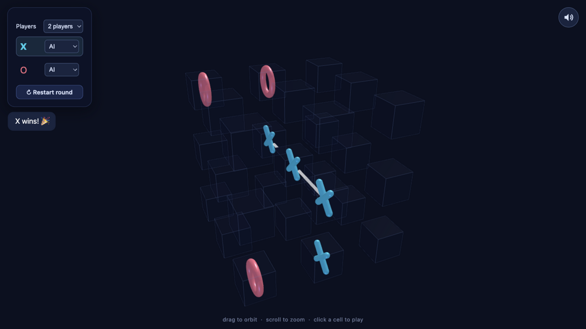

# You're Cooked

Three-dimensional tic-tac-toe on a 3×3×3 cube. Two or three players, on one device.

**[▶ Play](https://purpleheartseal.github.io/)**

## How to play

- Pick 2 or 3 players; each seat can be Human or AI.
- Drag to orbit, scroll to zoom, click a cell to place your mark.
- First straight line of three wins — rows, columns, plane diagonals, or diagonals through the cube (49 lines total).

## A little game theory

On a flat 3×3 board, perfect play always draws. The 3D cube breaks that balance: the **center cell lies on 13 of the 49 winning lines** — nearly twice as many as any corner. Take it first, and you threaten far more lines than any opponent can block; the first player has a forced win, which is where the game gets its name.

The built-in AI plays two-player minimax with alpha-beta pruning, and Maxⁿ for three players — each bot maximizes only its own outcome, so bots neither help nor spare each other. Search is depth-limited and time-boxed, so it plays strong but is beatable.

## Files

`index.html` landing page · `xo-3d.html` the game · `privacy.html` policy · `site.css` styles

Built with [Three.js](https://threejs.org/). Game logic runs in your browser without a game backend. The game page includes a third-party A-ADS banner. See the [privacy policy](privacy.html).
